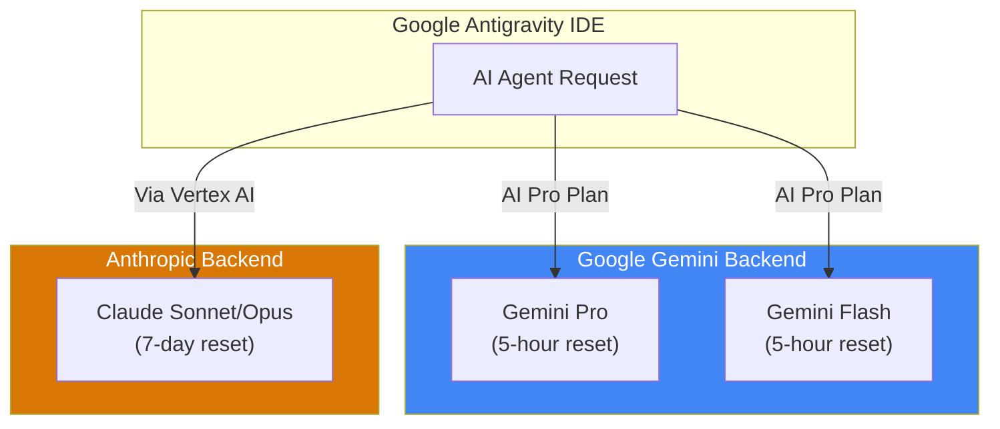

# Google Antigravity IDE Quota Analysis Report
> **Research Date:** December 30, 2025  
> **Subject:** TechQuotas Extension Quota Reset Discrepancy Analysis

---

## Executive Summary

The TechQuotas extension is **functioning correctly**. The observed difference in reset times—6 days for Anthropic vs ~5 hours for Gemini models—reflects **two fundamentally different rate limiting policies** from different AI providers.

> [!IMPORTANT]
> **Anthropic (Claude) uses WEEKLY rate limits** (7 days) for agentic services like Claude Code.  
> **Google (Gemini) uses HOURLY rate limits** (5 hours) for AI Pro subscribers in Antigravity.

---

## Your Current Quota Status

Based on the extension screenshot:

| Model | Usage | Time to Reset | Reset Type |
|-------|-------|---------------|------------|
| **Anthropic** | 98% | 6 days | Weekly (7-day rolling) |
| **Gemini Pro** | 95% | 04:51h | Hourly (5-hour rolling) |
| **Gemini Flash** | 73% | 02:55h | Hourly (5-hour rolling) |

---

## Why the Difference Exists

### Anthropic's Weekly Rate Limits

Anthropic implemented **weekly rate limits** effective **August 28, 2025** specifically for agentic coding services. Key facts:

- Quotas reset every **7 days** from the start of the usage window
- This applies to Claude Code, which is what Antigravity uses for Claude models
- The 5-hour window still exists for *session* limits, but an overarching **weekly cap** was introduced
- This was designed to manage intensive usage by power users (less than 5% of subscribers)

**For Sonnet 4 users:** Expect 140-280 hours/week  
**For Opus 4 users:** Expect 15-35 hours/week

> [!NOTE]
> **Holiday Promo (Dec 25-31, 2025):** Anthropic doubled usage limits for Pro/Max subscribers during this period. If you hit your limit before Dec 25, you may have benefited from a reset at midnight UTC on Dec 25th.

### Google Gemini's Hourly Limits

Google AI Pro subscribers in Antigravity enjoy **enhanced limits that reset every 5 hours**:

- This is a **premium benefit** specifically for Google AI Pro/Ultra subscribers
- Free users have **weekly-based** limits (similar to Anthropic)
- Quotas are calculated based on "work done" by the agent—complex tasks consume more quota

---

## Technical Architecture

---

## Quota Reset Mechanisms Comparison

| Aspect | Anthropic (Claude) | Google (Gemini) |
|--------|-------------------|-----------------|
| **Reset Frequency** | Weekly (7 days) | Every 5 hours |
| **Limit Type** | Token-based + Weekly cap | Work-based quota |
| **AI Pro Benefit** | Enhanced weekly cap | Enhanced 5-hour quota |
| **Free Tier** | ~100 messages/day | Weekly limits |
| **Holiday Bonus (2025)** | 2x limits Dec 25-31 | N/A |

---

## Recommendations

### Short-Term (Now)

1. **Continue using Gemini Pro/Flash** for intensive coding tasks—they reset in hours, not days
2. **Reserve Anthropic (Claude Opus 4.5)** for complex reasoning tasks that truly require its capabilities
3. Wait for the 6-day reset if you need Claude specifically

### Long-Term Strategy

1. **Monitor usage patterns:** If you frequently hit Anthropic limits, consider upgrading to Max tier (allows purchasing additional usage)
2. **Leverage model switching:** Use Antigravity's model selector strategically
   - Gemini Flash (73%) → Fast tasks, quick resets
   - Gemini Pro (95%) → Moderate complexity
   - Claude → Reserve for edge cases

---

## Is the Extension Bugged?

**No.** The TechQuotas extension is accurately reflecting:

- Anthropic's **independent weekly rate limit policy**
- Google's **5-hour reset policy** for AI Pro subscribers

The discrepancy is not a bug—it's a feature of how each AI provider manages their quotas differently.

---

## Sources

| Provider | Policy | Source |
|----------|--------|--------|
| Anthropic | Weekly limits (Aug 2025) | [Engadget](https://engadget.com), [Daily.dev](https://daily.dev) |
| Google | 5-hour reset for AI Pro | [blog.google](https://blog.google), [androidcentral.com](https://androidcentral.com) |
| Antigravity | Multi-model support | [Wikipedia](https://wikipedia.org), [googleblog.com](https://googleblog.com) |

---

*Report generated by TechSearch Agent • AC Tech*
